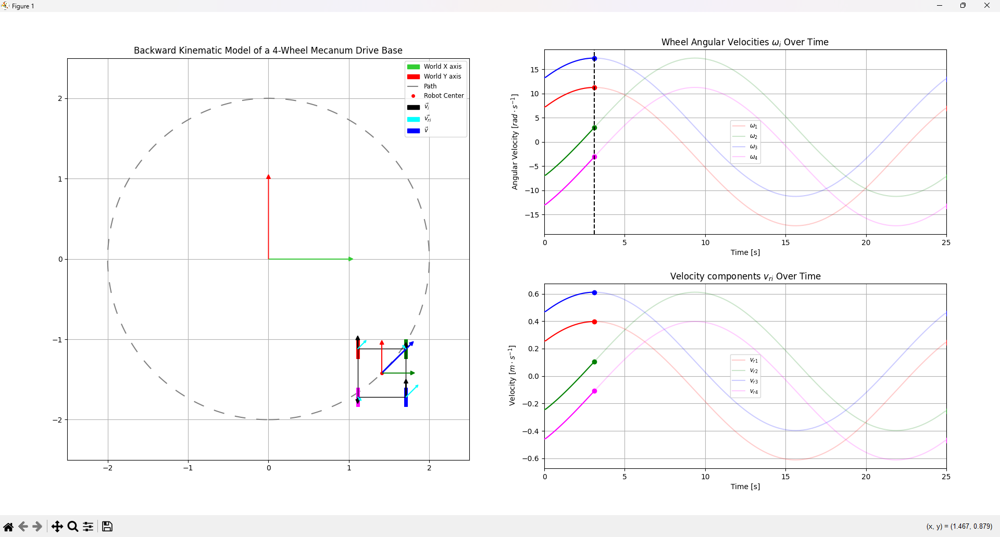

# Mecanum Robots Kinematics Simulator

This repository contains a Python simulation of a 4-wheel holonomic Mecanum drive base. It visualizes the robot's motion along different predefined paths and dynamically computes and displays individual wheel velocities, local and global velocity vectors, and rotational velocities.

## Features

- Simulates backward kinematic behavior of a 4-wheel Mecanum robot
- Supports different path shapes:
  - Circle
  - Square
  - Triangle
  - Horizontal line
  - Vertical line
- Calculates and visualizes:
  - Wheel angular velocities (`ω_i`)
  - Roller velocity projections (`v_{ri}`)
  - Velocity vectors in local and world frames
  - Robot trajectory and orientation
- Real-time animation using `matplotlib.animation`

## Requirements

- Python 3.7+
- numpy
- matplotlib
- scipy

Install requirements with:

```bash
pip install -r requirements.txt
```

## Usage

Run the simulation via:

```bash
python sim.py
```

You can optionally configure parameters by modifying the script:
- `R`: wheel radius
- `a`, `b`: distances from robot center to wheels (half-width/length)
- `T`: total time of path traversal
- `radius`: path radius or half-width/height
- `pathtype`: path shape (`circle`, `square`, `triangle`, `horizon`, `vertical`)
- `scale`: global scaling factor

Example line for launching with custom parameters (if you convert to CLI support):

```bash
python sim.py --R 0.05 --a 0.2 --b 0.2 --T 20 --radius 1 --pathtype square --scale 1.0
```

## Output

The simulator shows:
- **Left subplot**: robot trajectory and body animation
- **Top right subplot**: angular velocities (`ω_i`) of each wheel
- **Bottom right subplot**: velocity components projected onto roller directions (`v_{ri}`)

Colors correspond to wheel indices:
- Front Left: red
- Front Right: green
- Rear Right: blue
- Rear Left: magenta

## Structure

The main components of the simulation:
- **Path Generation**: `compute_robot_path()`
- **Velocity Calculations**:
  - `compute_velocity_vectors()`
  - `compute_omega_z()`
  - `compute_omega_data()`, `compute_vi_data()`, `compute_vri_data()`
- **Visualization**: `setup_figure()`, `run_animation()`

## License

This project is open source and available under the MIT License.

---

### Example Screenshot


> This project is useful for educational robotics, Mecanum kinematics understanding, and motion planning debugging.